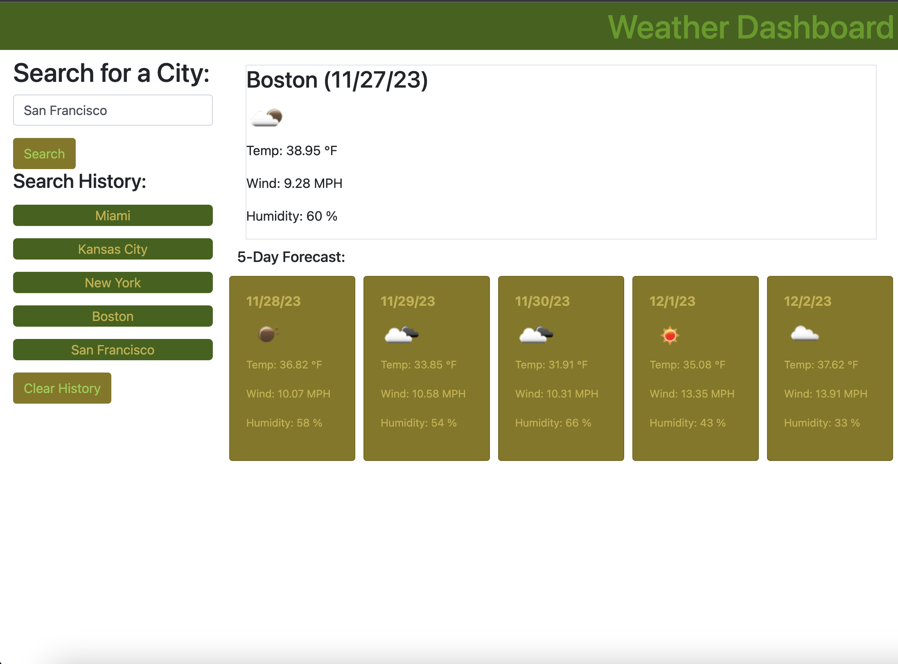

## Weather Dashboard
https://nikitaaa95.github.io/Weather-Dashboard/

## Description
The purpose of this site is to help users who might be traveling in planning. This will give the ability to quickly retrieve a snapshot of their destination anywhere within the US!

## Usage
The user will be brought to a page that is defaulted to New York weather. They can also use the search bar to find the weather for their future destination. Once they've searched for a city, that city will be saved in their search history. They can click on the search History section to retrieve the weather for that location. Even if the user refreshes the page, they will still be able to see their past search History. Once they've finished planning their travels, if they like, they can choose to clear their search history and start over.

## Ideas for future improvement
- Make the website default to local weather, instead of New York using GPS.
- Make available globally
- Create ability for the search bar to suggest results to the user
- Give user the ability to specify the state
- Make sure that invalid cities aren't saved to search history
- Limit search history so that only 5-10 most recent searches show up for the user

### Weather-Dashboard page

## Credits
Please see the following sites that were used:
### Bootstrap Documentation:
https://getbootstrap.com/docs/4.1/getting-started/introduction/

### Day.JS Documentation:
https://day.js.org/en/

### Weather API: 
https://openweathermap.org/api